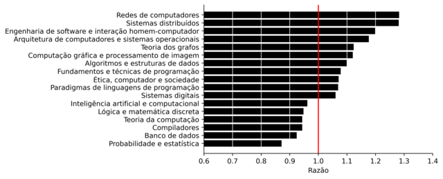
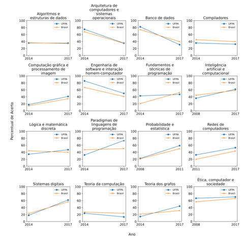
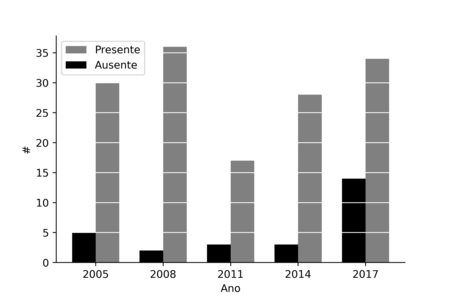

# KDD-Enade-Computing

[](https://travis-ci.com/renan-cunha/KDD-HigherEduBR) [](https://codecov.io/gh/renan-cunha/KDD-HigherEduBR)

Data Mining with the ENADE of Brazilian Computer Science courses

## About the Project

Enade is the exam applied at the end of the course in order to measure the performance of students.
This analysis uses ENADE microdata for all the Brazilian Computer Science Courses.
The goal is to provide information that can be useful for directors and coordinators
who want to improve the quality of their courses. 

The data tells:

1. which are the deficient subjects of the course (e.g., computer networks, software engineering, etc);
2. what is the change in performance in a given subject over the years; 
3. if the students have low participation in the exam. 





### Built with

* [Python](https://www.python.org/) and its Data Science toolkit ([Numpy](https://numpy.org/), [Pandas](https://pandas.pydata.org/),
  [Matplotlib](https://matplotlib.org/), [Seaborn](https://seaborn.pydata.org/))
* [Jupyter Notebooks](https://jupyter.org/)
* [Papermill](https://papermill.readthedocs.io/)
* [Cookiecutter Data Science Project Structure](https://drivendata.github.io/cookiecutter-data-science/)

## Getting Started

### Prerequisities

* Python 3.6.9+
* Linux
* Make

### Set up Environment

* Setup a virtual environment using python 3.6, use 
  [virtualenv](https://docs.python-guide.org/dev/virtualenvs/#lower-level-virtualenv) 
  or [conda](https://docs.conda.io/projects/conda/en/latest/user-guide/tasks/manage-environments.html)
## Usage

Run a first time to download and pre-process data, 
then run with the desired course.

### First time

```
make first_time
```

### Run the Analysis

To run the analysis, use the [e-mec code](https://emec.mec.gov.br/) of the computer science course you want. Below is an example with the course of UFPA

```
make code_course=12025 run_notebooks
```

### View the Results

All the results are presented in the ```results/``` folder.

```
cd results/
jupyter-notebook <name-of-the-notebook>.ipynb
```

## Contributing

Feel free to fork the project, we do not have the intent to close issues or accept pull requests in the moment.

## License

This project is licensed under the MIT License - see the [LICENSE](https://github.com/renan-cunha/KDD-HigherEduBR/blob/master/LICENSE) file 
for details.

## Contact

Renan Cunha - [renancunhafonseca@gmail.com](renancunhafonseca@gmail.com)

## Acknowledgements

This repository was developed as a research project at the Universidade Federal do Pará, with the guidance of Professor [Reginaldo Santos](https://www.escavador.com/sobre/5457885/reginaldo-cordeiro-dos-santos-filho).

[](https://portal.ufpa.br/ "Visite o site da UFPA")
